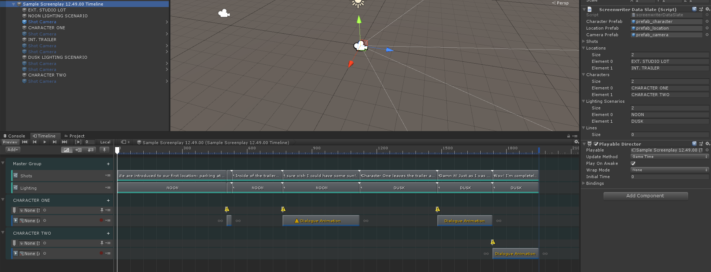
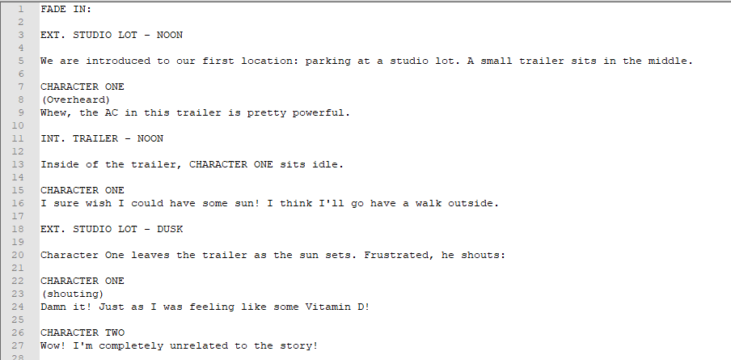
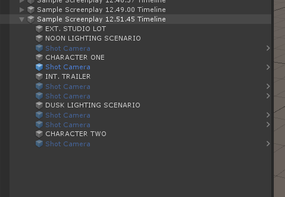
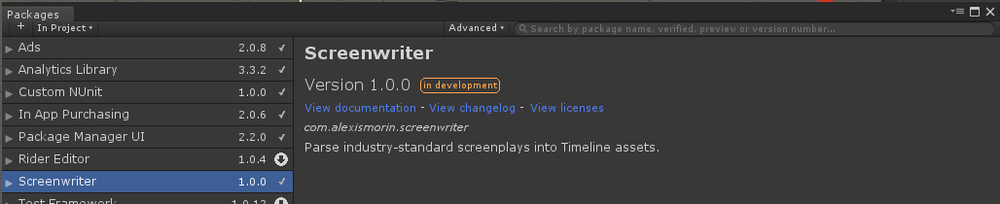

# Screenwriter
## Unity plugin to parse screenplays into Timelines.

Especially for smaller teams, starting the iteration process for Timelines can be a little overwhelming. Do you start from a storyboard, an animatic? Do you just mess around inside of the Editor until you find an idea? Quite fortunately, **screenplays** are a pretty universal way of laying out a story, are pretty much *always* an early part of the pipeline for any bit of visual storytelling and while they might not get you all the way there if you're laying out shots they're a great way to break down a sequence into smaller components.

With this plugin, you can now parse screenplays and import them into Unity as a Timeline asset, will all the correct track types and bindings auto-generated for you.

### File Ingestion

Simply click on the *Tools/Parse Screenplay* menu item and select a *.txt* file anywhere on your computer. Most screenplays (quite obviously) conform to an industry standard so even the stuff you wrote previously should work out of the box.

This is what the plugin will parse:

- Sluglines: EXT. LOCATION - TIME OF DAY
- Character Names: FIRSTNAME LASTNAME
- Additonal directing instructions: (in parentheses)
- Dialog
- And just plain action text.

The cuts and their lengths will be guestimated on the lenght of the action so while you'll obviously have to do some adjustments  afterwards it should get you started. A camera prefab is also created for each shot And signal and animation tracks are autogenerated for characters.

When in doubt, you can always refer to the Sample Screenplay included and the excellent [screenwriting.info](http://www.screenwriting.info/).

### Install process
This is a plugin that makes use of Unity's new *Package Manager* feature. Just drop the *com.alexismorin.screenwriter* folder into your *packages* folder (found at the same level as your Assets folder) and it should work out-of-the-box. If you're using an older version of Unity, navigate inside the *com.alexismorin.screenwriter* folder and then just drag the contents you find there anywhere in your project hierarchy.

### TODO
- Add transition support
- Fix bugs and jankiness
- Improve documentation

